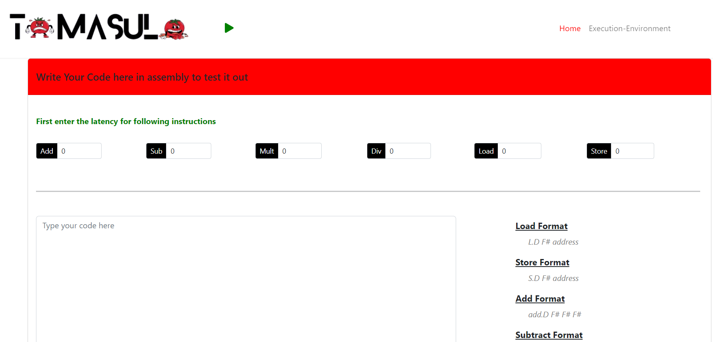

# Tomasulo Algorithm Simulator


## Project Overview
This project is a simulation tool for the Tomasulo algorithm, designed to visually demonstrate the execution of MIPS assembly instructions. It features both a command-line interface (CLI) and a graphical user interface (GUI), offering interactive exploration of processes within reservation stations, the register file, and instruction queuing. This tool allows users to input and modify instruction latencies to observe varied operational outcomes, making it a valuable educational resource for students and professionals interested in computer architecture and MIPS instruction set.

## Features
- **Command-Line Interface**: Allows for direct input and manipulation of MIPS instructions and viewing of simulation steps.
- **Graphical User Interface**: Enhances user interaction through a more intuitive visual representation of the simulation process.
- **Interactive Execution**: Users can step through the simulation, seeing the effects of each instruction on the processor’s state.
- **Customizable Latencies**: Supports configuration of different latencies for various operations, enabling detailed performance analysis.

## Technologies Used
- Node.js
- Express.js
- EJS for templating
- JSDOM for DOM manipulation on the server side
- Inline CSS for styling

## Installation

To get this project up and running on your local machine, follow these steps:

1. **Clone the Repository**
   ```bash
   git clone https://github.com/yourusername/Tomasulo-simulator.git
   cd Tomasulo-simulator

## Install Dependencies 
-npm install

## Start the server
-npm start

## To access the website 
-Open your web browser and go to http://localhost:8000/Home to start using the simulator.


   
